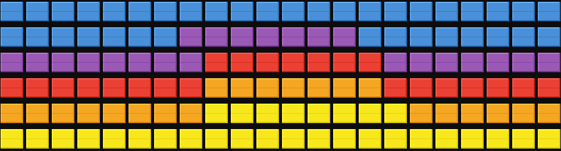
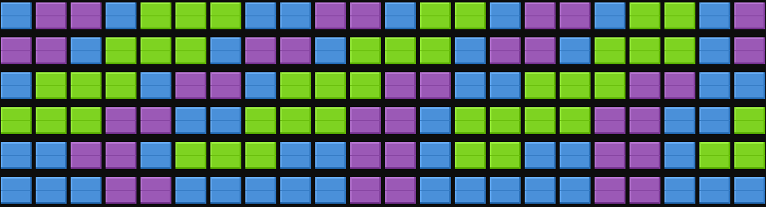
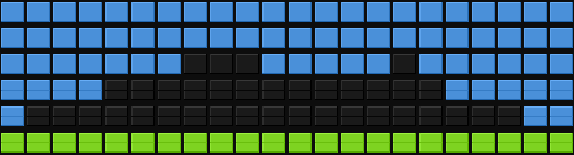
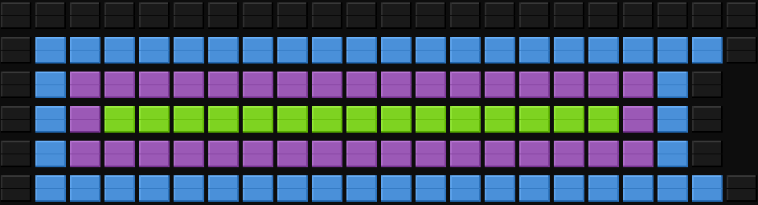

# Generative AI Art Setup Guide

Each refresh, the plugin asks an LLM to compose a full-screen abstract art piece for your split-flap display using the board's 8-colour palette. Every piece is unique — rotating through 30 built-in themes like aurora borealis, Mondrian-style blocks, mountain silhouettes, and more.



| Aurora Borealis | Mountain Silhouette | Concentric Rings |
|---|---|---|
|  |  |  |

## Overview

**What it does:**
- Generates unique full-screen colour art on every refresh
- Uses any OpenAI v1-compatible endpoint (OpenAI, Ollama, OpenRouter, LM Studio, etc.)
- Supports both Flagship (6 × 22) and Note (3 × 15) display sizes
- Falls back gracefully — if the LLM is unavailable the last piece stays on screen
- 30 built-in artistic themes, or supply your own

**Use Cases:**
- Ambient art display that changes throughout the day
- Showcase your local LLM's creative capabilities
- Rotating colour piece for a gallery wall or office

## Prerequisites

- ✅ An OpenAI-compatible API endpoint
- ✅ An API key (use any value, e.g. `"ollama"`, for local endpoints)

## Quick Setup

### Option A: OpenAI

```yaml
# docker-compose.override.yml
services:
  fiestaboard:
    environment:
      GENERATIVE_AI_ART_API_KEY: "sk-..."
      GENERATIVE_AI_ART_MODEL: "gpt-4o-mini"
```

### Option B: Ollama (local, free)

```yaml
services:
  fiestaboard:
    environment:
      GENERATIVE_AI_ART_API_KEY: "ollama"
      GENERATIVE_AI_ART_API_BASE_URL: "http://ollama:11434/v1"
      GENERATIVE_AI_ART_MODEL: "llama3.2"
```

### Option C: OpenRouter

```yaml
services:
  fiestaboard:
    environment:
      GENERATIVE_AI_ART_API_KEY: "sk-or-..."
      GENERATIVE_AI_ART_API_BASE_URL: "https://openrouter.ai/api/v1"
      GENERATIVE_AI_ART_MODEL: "anthropic/claude-3-haiku"
```

## Configuration Reference

| Setting | Default | Description |
|---|---|---|
| `api_key` *(required)* | — | API key for your endpoint. |
| `api_base_url` | `https://api.openai.com/v1` | Base URL for the chat completions endpoint. |
| `model` | `gpt-4o-mini` | Model to use for art generation. |
| `device_type` | `flagship` | `flagship` (6×22) or `note` (3×15). |
| `temperature` | `1.2` | Sampling temperature (0–2). 1.0–1.4 gives varied, artistic results. |
| `refresh_seconds` | `1800` | How often to generate a new piece (minimum 300 s / 5 min). |
| `themes` | `[]` | Custom theme list. Empty = use the 30 built-in themes. |
| `extra_instructions` | `""` | Additional instructions appended to the prompt (e.g. `"favour cool colours"`). |

## Template Variables

| Variable | Description |
|---|---|
| `generative_ai_art.art` | Full-board colour pattern — use this in your page template |
| `generative_ai_art.theme` | Theme of the current piece |
| `generative_ai_art.description` | One-sentence artist's description |
| `generative_ai_art.model` | Model that generated the piece |
| `generative_ai_art.generated_at` | ISO timestamp of generation |

## Page Template

The simplest page template uses the full board for art:

```
{{generative_ai_art.art}}
```

You can combine art with text on unused rows (art fills row 1 and wraps down):

```
{{generative_ai_art.art}}
```

## Tips

- **Temperature 1.0–1.4** gives the best balance of creativity and structure. Higher values produce more chaotic results.
- **Shorter refresh intervals** (e.g. 300 s) work well with fast local models; longer intervals (e.g. 3600 s) are better for rate-limited API endpoints.
- Use **`extra_instructions`** to steer the palette — e.g. `"use only warm colours"` or `"favour dark, moody compositions"`.
- Any OpenAI-compatible local model works; smaller models (7B–13B parameters) produce surprisingly good results.
