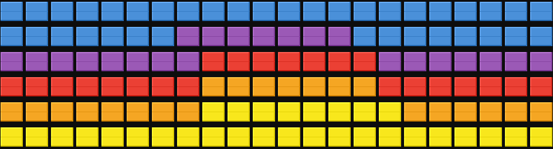
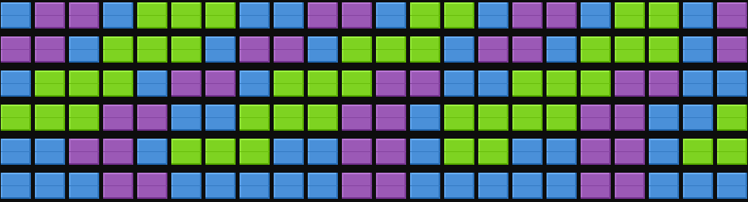
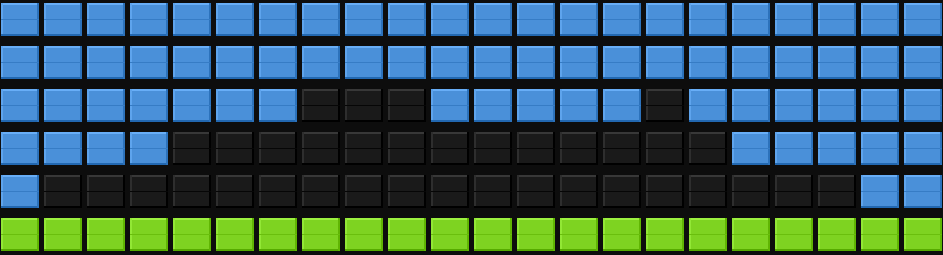
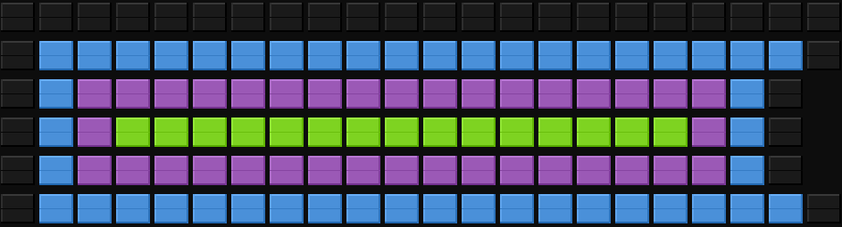

# Generative AI Art Setup Guide

Set up Generative AI Art to fill your board with a new AI-composed art piece on every refresh, from a split-flap Note to a full-colour LED pixel display.



| Aurora Borealis | Mountain Silhouette | Concentric Rings |
|---|---|---|
|  |  |  |

## Overview

Generative AI Art uses your FiestaBoard AI provider: the one set up in **Settings → AI Providers**, the same one FiestaBot uses. There is no key, endpoint or sign-in to set up in the plugin.

**What it does:**
- Generates unique full-screen art on every refresh, rotating through 63 built-in themes like aurora borealis, Mondrian-style blocks and mountain silhouettes, or your own
- Uses your FiestaBoard AI provider: any protocol (OpenAI-compatible, Anthropic, OpenAI Responses) and any connection (pasted key, or a sign-in with OpenRouter, Hugging Face or ChatGPT)
- Optionally uses a separate API key for any OpenAI v1-compatible endpoint instead
- Fills **any** board: Flagship (22 × 6), Note (15 × 3), a note array up to 120 × 24, or a FiestaPanel up to 128 × 96 — nothing to configure
- On an **LED pixel display** (a Divoom Pixoo 64, for example) draws full-colour pixel art at the display's pixel size, through the `canvas` variable
- Falls back gracefully — if the model is unavailable the last piece *for that board* stays on screen

### Board sizes

The plugin reads the board it is rendering on and derives everything from it, so the same configuration serves a Note, a Flagship and a wall-sized panel at the same time.

For small boards (up to 240 tiles — a Note, a Flagship, a 15 × 12 array) the model names one colour per tile. Above that, asking for 2,880 individual tiles would be a ~12,000-token reply that most models truncate, so the model instead returns a compact **scene description** — regions, gradients, shapes in normalised `0..1` coordinates — which the plugin rasterises to the board. That request costs the same whatever the board's size, and it composes for the board's real aspect ratio.

On an LED pixel display the model is told it is drawing for an RGB LED matrix of the display's exact pixel size (64 × 64 when the board does not report one), may use any `#rrggbb` colour, and can layer up to 60 shapes with gradients. The plugin returns that drawing as a canvas, checked against FiestaBoard's canvas limits, and samples the same picture into the 8-colour `art` variable — one model call for both.

**Use cases:**
- Ambient art display that changes throughout the day
- A living pixel-art frame on a Pixoo
- Showcase your local LLM's creative capabilities

### Prerequisites

- ✅ FiestaBoard 9.11.0 or later
- ✅ An AI provider in **Settings → AI Providers**, **or** a separate API key for an OpenAI-compatible endpoint
- ✅ For full-colour art on an LED pixel display: a FiestaBoard with pixel-canvas support (the canvas engine, FiestaBoard PR #2228, plus canvases on pages from its follow-up). Without it, the plugin shows tile art as before

## Quick Setup

1. **Enable** — Open **Settings → AI Providers** and add a provider, or sign in with OpenRouter, Hugging Face or ChatGPT. Make sure AI is turned on. Then open **Settings → Integrations**, select **Generative AI Art**, and enable it.
2. **Configure** — Leave **AI Provider** empty to use FiestaBot's default provider, or pick one. Leave **AI Model** empty for that provider's default model, or type one. Leave **Use a separate API key** empty unless you want this plugin to skip your AI providers (see [Separate API key](#separate-api-key)).
3. **Template** — Use the plugin's demo page, or build a page:
   - **Split-flap boards:** put `{{generative_ai_art.art}}` on the first line with wrapping on. It fills the board.
   - **LED pixel displays:** add a canvas over the whole page with `{{generative_ai_art.canvas}}` as its source (see [Page templates](#page-templates)).
4. **View** — Send the page to your board. A new piece arrives every refresh interval (30 minutes by default, 5 at the least).

### Separate API key

Paste a key in **Use a separate API key** only if you want this plugin to skip your AI providers. A saved key always wins: the plugin then calls **Separate API Base URL** with **Separate API Model** directly, exactly as earlier versions did. The same settings can come from environment variables:

#### Option A: OpenAI

```yaml
# docker-compose.override.yml
services:
  fiestaboard:
    environment:
      GENERATIVE_AI_ART_API_KEY: "sk-..."
      GENERATIVE_AI_ART_MODEL: "gpt-4o-mini"
```

#### Option B: Ollama (local, free)

```yaml
services:
  fiestaboard:
    environment:
      GENERATIVE_AI_ART_API_KEY: "ollama"
      GENERATIVE_AI_ART_API_BASE_URL: "http://ollama:11434/v1"
      GENERATIVE_AI_ART_MODEL: "llama3.2"
```

#### Option C: OpenRouter

```yaml
services:
  fiestaboard:
    environment:
      GENERATIVE_AI_ART_API_KEY: "sk-or-..."
      GENERATIVE_AI_ART_API_BASE_URL: "https://openrouter.ai/api/v1"
      GENERATIVE_AI_ART_MODEL: "anthropic/claude-3-haiku"
```

### Page templates

**Split-flap boards.** The whole board is the art, so the template is a single variable on the first line with wrapping on:

```text
{{generative_ai_art.art}}
```

Turn on **Show Title** to spend the bottom row on a short centred label; the art then fills every row above it, on any board.

**LED pixel displays — full-bleed canvas.** A canvas covering the page, taking its drawing from the plugin. The area names the largest grid FiestaBoard supports and is clamped to your board; `"bleed": ["all"]` reaches the panel's edge and `"text": "hide"` blanks the text underneath. The tile art stays in the template, so a board that does not draw canvases still shows art.

```json
{
  "template": ["{{generative_ai_art.art}}"],
  "canvases": [
    {
      "id": "art",
      "area": {"row": 1, "col": 1, "rows": 96, "cols": 128},
      "bleed": ["all"],
      "text": "hide",
      "source": "{{generative_ai_art.canvas}}"
    }
  ]
}
```

**LED pixel displays — art under a title line.** The first row holds the theme; the canvas fills the rest, and `"text": "flow"` keeps the text to the cells the canvas leaves free.

```json
{
  "template": ["{{generative_ai_art.theme}}"],
  "line_metadata": [{"alignment": "center", "wrap": false}],
  "canvases": [
    {
      "id": "art",
      "area": {"row": 2, "col": 1, "rows": 95, "cols": 128},
      "bleed": ["left", "right", "bottom"],
      "text": "flow",
      "source": "{{generative_ai_art.canvas}}"
    }
  ]
}
```

## Template Variables

| Variable | Description |
|---|---|
| `generative_ai_art.art` | Full-board colour pattern, sized to the board — use this in a split-flap page template |
| `generative_ai_art.canvas` | Full-colour pixel art for a page canvas's `source` on an LED pixel display; on a split-flap board, the tile art with one pixel per tile |
| `generative_ai_art.theme` | Theme of the current piece |
| `generative_ai_art.description` | One-sentence artist's description |
| `generative_ai_art.model` | Model that generated the piece |
| `generative_ai_art.generated_at` | ISO timestamp of generation |

## Configuration Reference

| Setting | Default | Description |
|---|---|---|
| `ai_provider` | `""` | FiestaBoard AI provider to use. Empty = FiestaBot's default provider. |
| `ai_model` | `""` | Model for that provider. Empty = the provider's default model. |
| `api_key` | — | Optional separate API key. When set it always wins over the AI provider. |
| `api_base_url` | `https://api.openai.com/v1` | With a separate API key: base URL for the chat completions endpoint. |
| `model` | `gpt-4o-mini` | With a separate API key: model to use. |
| `temperature` | `1.2` | Sampling temperature (0–2). 1.0–1.4 gives varied, artistic results. Anthropic providers accept at most 1.0, so higher values are sent as 1.0. |
| `refresh_seconds` | `1800` | How often to generate a new piece (minimum 300 s / 5 min). |
| `themes` | `[]` | Custom theme list. Empty = use the 63 built-in themes. |
| `extra_instructions` | `""` | Additional instructions appended to the prompt on every board (e.g. `"favour cool colours"`). |
| `custom_system_prompt` | `""` | Replaces the whole system prompt on every board, pixel displays included. |
| `show_title` | `false` | Spend the bottom board row on a short centred title (`art` only). |

| Environment variable | Default |
|---|---|
| `GENERATIVE_AI_ART_ENABLED` | `false` |
| `GENERATIVE_AI_ART_API_KEY` | — |
| `GENERATIVE_AI_ART_API_BASE_URL` | `https://api.openai.com/v1` |
| `GENERATIVE_AI_ART_MODEL` | `gpt-4o-mini` |
| `GENERATIVE_AI_ART_TEMPERATURE` | `1.2` |
| `GENERATIVE_AI_ART_REFRESH_SECONDS` | `1800` |
| `GENERATIVE_AI_ART_SHOW_TITLE` | `false` |

## Troubleshooting

**"Set up AI in Settings → AI Providers…"**
AI is turned off, no provider is set up, or the picked provider was deleted.

**"Reconnect the AI provider in Settings → AI Providers…"**
The provider refused its key or sign-in.

**"Update FiestaBoard to use its AI providers, or paste an API key…"**
This FiestaBoard is older than 9.11.0. Update it, or use a separate API key.

**The LED display shows tile art, not full-colour art**
Your FiestaBoard does not draw canvases yet, or the page has no canvas. Add a canvas sourced from `{{generative_ai_art.canvas}}` (see [Page templates](#page-templates)) on a FiestaBoard with pixel-canvas support.

**The same twilight landscape keeps appearing on the LED display**
That is the fallback scene: the model call failed and there was no earlier piece for that display. FiestaBoard's logs say why; a new piece arrives on the next successful refresh.

**The art looks chaotic**
Lower the temperature to 1.0–1.2, or steer it with `extra_instructions` — e.g. `"use only warm colours"` or `"favour dark, moody compositions"`.

**A local model gives up or returns broken replies**
Smaller models (7B–13B parameters) do well on split-flap boards. Full-colour pixel scenes ask for more structure; if they keep failing, try a larger model or a longer refresh interval.
